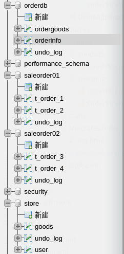

spring boot:shardingsphere多数据源,支持未分表的数据源(shardingjdbc 4.1.1) 

一，为什么要给shardingsphere配置多数据源？
1，shardingjdbc默认接管了所有的数据源，

如果我们有多个非分表的库时，则最多只能设置一个为默认数据库，

其他的非分表数据库不能访问

2，shardingjdbc对数据库的访问有一些限制：
官方站的说明：
https://shardingsphere.apache.org/document/legacy/4.x/document/cn/manual/sharding-jdbc/unsupported-items/

二，演示项目的相关信息
项目功能说明：

    演示shardingsphere集成了两个分表的库，1个默认库,

    非shardingsphere数据源集成了第4个数据库

数据库结构：

三，配置文件说明
1，pom.xml

<dependency>
            <groupId>org.springframework.boot</groupId>
            <artifactId>spring-boot-starter-web</artifactId>
            <exclusions>
                <exclusion>
                    <groupId>org.springframework.boot</groupId>
                    <artifactId>spring-boot-starter-logging</artifactId>
                </exclusion>
            </exclusions>
        </dependency>
        <!--sharding jdbc begin-->
        <dependency>
            <groupId>org.apache.shardingsphere</groupId>
            <artifactId>sharding-jdbc-core</artifactId>
            <version>4.1.1</version>
        </dependency>
        <!--sharding jdbc  end-->
        <!--mybatis begin-->
        <dependency>
            <groupId>org.mybatis.spring.boot</groupId>
            <artifactId>mybatis-spring-boot-starter</artifactId>
            <version>2.1.3</version>
        </dependency>
        <!--mybatis end-->
        <!--druid begin-->
        <dependency>
            <groupId>com.alibaba</groupId>
            <artifactId>druid-spring-boot-starter</artifactId>
            <version>1.1.23</version>
        </dependency>
        <dependency>
            <groupId>org.springframework.boot</groupId>
            <artifactId>spring-boot-starter-log4j2</artifactId>
        </dependency>
        <dependency>
            <groupId>com.lmax</groupId>
            <artifactId>disruptor</artifactId>
            <version>3.4.2</version>
        </dependency>
        <!--druid   end-->
        <!--mysql begin-->
        <dependency>
            <groupId>mysql</groupId>
            <artifactId>mysql-connector-java</artifactId>
            <scope>runtime</scope>
        </dependency>
        <!--mysql end-->
        <!--pagehelper begin-->
        <dependency>
            <groupId>com.github.pagehelper</groupId>
            <artifactId>pagehelper-spring-boot-starter</artifactId>
            <version>1.3.0</version>
        </dependency>
        <!--pagehelper end-->
        <!--thymeleaf begin-->
        <dependency>
            <groupId>org.springframework.boot</groupId>
            <artifactId>spring-boot-starter-thymeleaf</artifactId>
        </dependency>
        <!--thymeleaf end-->

2,application.properties

#error
server.error.include-stacktrace=always
#error
logging.level.org.springframework.web=trace
#name
spring.application.name = dynamic

# goodsdb数据源基本配置
spring.datasource.druid.goodsdb.username = root
spring.datasource.druid.goodsdb.password = lhddemo
spring.datasource.druid.goodsdb.driver-class-name = com.mysql.cj.jdbc.Driver
spring.datasource.druid.goodsdb.url = jdbc:mysql://127.0.0.1:3306/store?serverTimezone=UTC
spring.datasource.druid.goodsdb.type = com.alibaba.druid.pool.DruidDataSource
spring.datasource.druid.goodsdb.initialSize = 5
spring.datasource.druid.goodsdb.minIdle = 5
spring.datasource.druid.goodsdb.maxActive = 20
spring.datasource.druid.goodsdb.maxWait = 60000
spring.datasource.druid.goodsdb.timeBetweenEvictionRunsMillis = 60000
spring.datasource.druid.goodsdb.minEvictableIdleTimeMillis = 300000
spring.datasource.druid.goodsdb.validationQuery = SELECT 1 FROM DUAL
spring.datasource.druid.goodsdb.testWhileIdle = true
spring.datasource.druid.goodsdb.testOnBorrow = false
spring.datasource.druid.goodsdb.testOnReturn = false
spring.datasource.druid.goodsdb.poolPreparedStatements = true

#   配置监控统计拦截的filters，去掉后监控界面sql无法统计，'wall'用于防火墙
spring.datasource.druid.maxPoolPreparedStatementPerConnectionSize = 20
spring.datasource.druid.useGlobalDataSourceStat = true
spring.datasource.druid.connectionProperties = druid.stat.mergeSql=true;druid.stat.slowSqlMillis=500

#druid sql firewall monitor
spring.datasource.druid.filter.wall.enabled=true
#druid sql monitor
spring.datasource.druid.filter.stat.enabled=true
spring.datasource.druid.filter.stat.log-slow-sql=true
spring.datasource.druid.filter.stat.slow-sql-millis=10000
spring.datasource.druid.filter.stat.merge-sql=true
#druid uri monitor
spring.datasource.druid.web-stat-filter.enabled=true
spring.datasource.druid.web-stat-filter.url-pattern=/*
spring.datasource.druid.web-stat-filter.exclusions=*.js,*.gif,*.jpg,*.bmp,*.png,*.css,*.ico,/druid/*
#druid session monitor
spring.datasource.druid.web-stat-filter.session-stat-enable=true
spring.datasource.druid.web-stat-filter.profile-enable=true
#druid spring monitor
spring.datasource.druid.aop-patterns=com.druid.*
#monintor,druid login user config
spring.datasource.druid.stat-view-servlet.enabled=true
spring.datasource.druid.stat-view-servlet.login-username=root
spring.datasource.druid.stat-view-servlet.login-password=root
# IP白名单 (没有配置或者为空，则允许所有访问)
spring.datasource.druid.stat-view-servlet.allow = 127.0.0.1,192.168.163.1
# IP黑名单 (存在共同时，deny优先于allow)
spring.datasource.druid.stat-view-servlet.deny = 192.168.10.1
#mybatis
mybatis.mapper-locations=classpath:/mapper/sharding/*Mapper.xml
#mybatis.type-aliases-package=com.example.demo.mapper
mybatis.configuration.log-impl=org.apache.ibatis.logging.stdout.StdOutImpl
#log
logging.config = classpath:log4j2.xml

#shardingsphere第一个分表数据源
spring.datasource.druid.saleorder01.type=com.alibaba.druid.pool.DruidDataSource
spring.datasource.druid.saleorder01.driverClassName=com.mysql.cj.jdbc.Driver
spring.datasource.druid.saleorder01.url=jdbc:mysql://127.0.0.1:3306/saleorder01?characterEncoding=utf-8
spring.datasource.druid.saleorder01.username=root
spring.datasource.druid.saleorder01.password=lhddemo
#shardingsphere第二个分表数据源
spring.datasource.druid.saleorder02.type=com.alibaba.druid.pool.DruidDataSource
spring.datasource.druid.saleorder02.driverClassName=com.mysql.cj.jdbc.Driver
spring.datasource.druid.saleorder02.url=jdbc:mysql://127.0.0.1:3306/saleorder02?characterEncoding=utf-8
spring.datasource.druid.saleorder02.username=root
spring.datasource.druid.saleorder02.password=lhddemo
#shardingsphere第三个数据源，非分表，作为默认库访问
spring.datasource.druid.orderdb.type=com.alibaba.druid.pool.DruidDataSource
spring.datasource.druid.orderdb.driverClassName=com.mysql.cj.jdbc.Driver
spring.datasource.druid.orderdb.url=jdbc:mysql://127.0.0.1:3306/orderdb?characterEncoding=utf-8
spring.datasource.druid.orderdb.username=root
spring.datasource.druid.orderdb.password=lhddemo

3,各数据表的建表语句:

我们创建两个库:saleorder01,saleorder02

然后在各个库内各创建两个数据表:

saleorder01库包括t_order_1,t_order_2

saleorder02库包括t_order_3,t_order_4